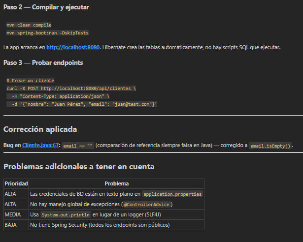

# DigitalBank

Pasos para hacer funcionar el proyecto
Prerequisitos

java -version    # Necesita Java 17+
mvn -version     # Maven 3.8+
Paso 1 — Levantar PostgreSQL
El proyecto espera PostgreSQL en el puerto 8181 (no estándar). La opción más rápida es con Docker:

docker run --name banco-db \
  -e POSTGRES_USER=postgres \
  -e POSTGRES_PASSWORD=balbuena022000 \
  -e POSTGRES_DB=banco_db \
  -p 8181:5432 \
  -d postgres:15
Si ya tienes PostgreSQL instalado, crea la base de datos y ajusta el puerto en application.properties:

spring.datasource.url=jdbc:postgresql://localhost:TU_PUERTO/banco_db
Paso 2 — Compilar y ejecutar

mvn clean compile
mvn spring-boot:run -DskipTests

La app arranca en http://localhost:8080. Hibernate crea las tablas automáticamente, no hay scripts SQL que ejecutar.

Paso 3 — Probar endpoints

# Crear un cliente
curl -X POST http://localhost:8080/api/clientes \
  -H "Content-Type: application/json" \
  -d '{"nombre": "Juan Pérez", "email": "juan@test.com"}'
Corrección aplicada
Bug en Cliente.java:67: email == "" (comparación de referencia siempre falsa en Java) — corregido a email.isEmpty().

Problemas adicionales a tener en cuenta
Prioridad	Problema
ALTA	Las credenciales de BD están en texto plano en application.properties
ALTA	No hay manejo global de excepciones (@ControllerAdvice)
MEDIA	Usa System.out.println en lugar de un logger (SLF4J)
BAJA	No tiene Spring Security (todos los endpoints son públicos)

